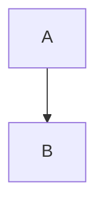
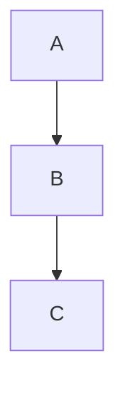

# MDExMermaid Usage Rules

MDExMermaid is a plugin for [MDEx](https://hex.pm/packages/mdex) that enables rendering [Mermaid](https://mermaid.js.org) diagrams from markdown code blocks.

## Quick Reference

**TL;DR:** Attach MDExMermaid to MDEx documents to convert mermaid code blocks into rendered diagrams.

```elixir
MDEx.new(markdown: markdown)
|> MDExMermaid.attach()
|> MDEx.to_html!()
```

For complete working examples, see the [examples directory](https://github.com/leandrocp/mdex_mermaid/tree/main/examples).

---

## When to Use

Use MDExMermaid when you need to:
- Render Mermaid diagrams from markdown content
- Support flowcharts, sequence diagrams, gantt charts, mindmaps, and other Mermaid diagram types
- Integrate Mermaid diagrams into Phoenix LiveView applications
- Convert markdown with Mermaid code blocks to HTML

---

## Core API

### Function Signature

```elixir
@spec MDExMermaid.attach(MDEx.Document.t(), keyword()) :: MDEx.Document.t()
```

```elixir
MDExMermaid.attach(document, options \\ [])
```

### Type Definitions

```elixir
@type mermaid_pre_attrs :: (seq :: pos_integer() -> String.t())
```

The `seq` parameter is a sequence number starting at 1 that auto-increments for each mermaid code block found in the document.

### Options

- `:mermaid_init` (`String.t()`) - HTML to initialize Mermaid. Set to `""` to disable auto-injection.
- `:mermaid_pre_attrs` (`mermaid_pre_attrs()`) - Function to generate `<pre>` tag attributes for each diagram.

---

## Default Behavior

When you call `MDExMermaid.attach()` with no options, the following happens automatically:

1. **Mermaid v11 CDN script is injected** at the top of the HTML document
2. **Each diagram gets these attributes**: `id="mermaid-{seq}" class="mermaid" phx-update="ignore"`
3. **Dark mode auto-detection** via `prefers-color-scheme` media query
4. **Security level** is set to `'loose'`
5. **HTML unsafe mode is enabled** in MDEx (allows raw HTML injection)
6. **Sequence numbering** starts at 1 and increments (e.g., "mermaid-1", "mermaid-2", etc.)

### Default `:mermaid_init` Value

```html
<script type="module">
  import mermaid from 'https://cdn.jsdelivr.net/npm/mermaid@11/dist/mermaid.esm.min.mjs';
  const theme = window.matchMedia && window.matchMedia('(prefers-color-scheme: dark)').matches ? 'dark' : 'default';
  mermaid.initialize({securityLevel: 'loose', theme: theme});
</script>
```

**Note:** The `window.matchMedia &&` check prevents errors in environments where `matchMedia` is not available.

### Default `:mermaid_pre_attrs` Value

```elixir
fn seq -> ~s(id="mermaid-#{seq}" class="mermaid" phx-update="ignore") end
```

**Important:** The default includes `phx-update="ignore"` even for non-LiveView applications. This is harmless in static contexts but crucial for LiveView to prevent re-rendering issues.

---

## Pipeline Order

MDExMermaid uses MDEx's plugin system. The correct order is:

1. **Create MDEx document**: `MDEx.new/1`
2. **Attach plugins**: `MDExMermaid.attach/2`
3. **Convert to HTML**: `MDEx.to_html!/1`

```elixir
MDEx.new(markdown: markdown)
|> MDExMermaid.attach(options)
|> MDEx.to_html!()
```

**Anti-pattern:**
```elixir
# BAD - attach must be called before to_html
html = MDEx.to_html!(mdex)
mdex = MDExMermaid.attach(mdex)  # Too late!
```

---

## Code Block Detection

MDExMermaid only processes code blocks tagged as `mermaid`:

````markdown

````

Other code blocks are left untouched. The code block is converted to:

```html
<pre id="mermaid-1" class="mermaid" phx-update="ignore">
graph TD;
    A-->B;
</pre>
```

---

## Static HTML Usage

### Basic Static Document

For simple static documents, the default configuration works out of the box:

```elixir
markdown = """

"""

html =
  MDEx.new(markdown: markdown)
  |> MDExMermaid.attach()
  |> MDEx.to_html!()
```

This injects the default initialization script and renders all mermaid code blocks automatically.

### Custom Pre Attributes

The `:mermaid_pre_attrs` option takes a function that receives a sequence number and returns an attribute string:

```elixir
pre_attrs = fn seq ->
  ~s(id="diagram-#{seq}" class="mermaid custom-class")
end

html =
  MDEx.new(markdown: markdown)
  |> MDExMermaid.attach(mermaid_pre_attrs: pre_attrs)
  |> MDEx.to_html!()
```

**IMPORTANT:** Always include unique IDs in custom pre attributes. The sequence number ensures uniqueness.

### DOMContentLoaded Pattern

For pages that require waiting for DOM ready:

```elixir
@mermaid_init """
<script defer src="https://cdn.jsdelivr.net/npm/mermaid@11/dist/mermaid.esm.min.mjs"></script>
<script>
  document.addEventListener("DOMContentLoaded", () => {
    const theme = window.matchMedia && window.matchMedia('(prefers-color-scheme: dark)').matches ? 'dark' : 'default';
    mermaid.initialize({securityLevel: 'loose', theme: theme});
  });
</script>
"""

html =
  MDEx.new(markdown: markdown)
  |> MDExMermaid.attach(mermaid_init: @mermaid_init)
  |> MDEx.to_html!()
```

### Custom Themes

The default configuration auto-detects dark/light mode. For custom themes, override `:mermaid_init`:

```elixir
@mermaid_init """
<script type="module">
  import mermaid from 'https://cdn.jsdelivr.net/npm/mermaid@11/dist/mermaid.esm.min.mjs';
  mermaid.initialize({
    securityLevel: 'loose',
    theme: 'forest'  // or 'dark', 'neutral', 'base'
  });
</script>
"""

html =
  MDEx.new(markdown: markdown)
  |> MDExMermaid.attach(mermaid_init: @mermaid_init)
  |> MDEx.to_html!()
```

---

## Phoenix LiveView Usage

### Overview

LiveView requires special handling because:
1. You manage Mermaid initialization in your layout/app.js
2. Diagrams need protection from re-rendering
3. Hooks are required to render diagrams after mount/update

### Setup Step 1: Load Mermaid

Choose **Option A (CDN)** or **Option B (npm)**, not both.

#### Option A: Using CDN in Layout

```html
<!-- In your root.html.heex or layout -->
<script type="module">
  import mermaid from 'https://cdn.jsdelivr.net/npm/mermaid@11/dist/mermaid.esm.min.mjs';
  const theme = window.matchMedia && window.matchMedia('(prefers-color-scheme: dark)').matches ? 'dark' : 'default';
  mermaid.initialize({
    startOnLoad: false,  // IMPORTANT: false for LiveView
    securityLevel: 'loose',
    theme: theme
  });
  window.mermaid = mermaid;  // Make available globally
</script>
```

#### Option B: Using npm

Install Mermaid as a dependency:

```bash
cd assets && npm install mermaid
```

In your `assets/js/app.js`:

```javascript
import mermaid from 'mermaid'

const theme = window.matchMedia && window.matchMedia('(prefers-color-scheme: dark)').matches ? 'dark' : 'default';

mermaid.initialize({
  startOnLoad: false,  // IMPORTANT: false for LiveView
  securityLevel: 'loose',
  theme: theme
})

let hooks = {
  MermaidHook: {
    mounted() {
      mermaid.run({ querySelector: '.mermaid' });
    }
  }
}

let liveSocket = new LiveSocket("/live", Socket, {
  params: {_csrf_token: csrfToken},
  hooks: hooks
})
```

### Setup Step 2: Configure MDExMermaid

```elixir
def mount(_params, _session, socket) do
  html =
    MDEx.new(markdown: markdown)
    |> MDExMermaid.attach(
      mermaid_init: "",  # Don't inject - already in layout
      mermaid_pre_attrs: fn seq ->
        ~s(id="mermaid-#{seq}" class="mermaid" phx-hook="MermaidHook")
      end
    )
    |> MDEx.to_html!()

  {:ok, assign(socket, html: {:safe, html})}
end
```

### Setup Step 3: Render in Template

```elixir
def render(assigns) do
  ~H"""
  <div>
    <%= @html %>
  </div>
  """
end
```

**Note:** The `{:safe, html}` wrapping happens at assignment time (in `mount`), not in the template.

---

## LiveView Patterns

### Pattern 1: Per-Diagram Hook (Static Content)

Use this when diagram content doesn't change after mount.

```elixir
# In LiveView
mermaid_pre_attrs: fn seq ->
  ~s(id="mermaid-#{seq}" class="mermaid" phx-hook="MermaidHook")
end
```

```javascript
// In app.js
MermaidHook: {
  mounted() {
    mermaid.run({ querySelector: '.mermaid' });
  }
}
```

**When to use:** Content is generated once in `mount` and never changes.

### Pattern 2: Global Hook on Parent (Dynamic Content)

Use this when diagram content changes during LiveView lifecycle.

```elixir
def render(assigns) do
  ~H"""
  <div id="content" phx-hook="MermaidGlobalHook">
    <%= @html %>
  </div>
  """
end

# Optionally override pre_attrs to remove individual hooks
mermaid_pre_attrs: fn seq ->
  ~s(id="mermaid-#{seq}" class="mermaid")
end
```

```javascript
// In app.js
MermaidGlobalHook: {
  mounted() {
    mermaid.run({ querySelector: '.mermaid' });
  },
  updated() {
    mermaid.run({ querySelector: '.mermaid' });
  }
}
```

**When to use:** Content updates dynamically (e.g., user switches between different diagrams, real-time updates).

### Pattern 3: Using Default Attributes

The default `mermaid_pre_attrs` includes `phx-update="ignore"`, which prevents LiveView from updating diagram elements:

```elixir
# Uses default: id="mermaid-{seq}" class="mermaid" phx-update="ignore"
MDEx.new(markdown: markdown)
|> MDExMermaid.attach(mermaid_init: "")
|> MDEx.to_html!()
```

**When to use:** When you want maximum protection against LiveView updates, though this may interfere with dynamic content updates.

---

## Best Practices

### 1. Always Use Unique IDs

Each mermaid diagram must have a unique ID for proper rendering:

```elixir
# GOOD - uses sequence number for uniqueness
fn seq -> ~s(id="mermaid-#{seq}" class="mermaid") end

# BAD - all diagrams have same ID
fn _seq -> ~s(id="mermaid" class="mermaid") end
```

### 2. Set startOnLoad: false in LiveView

When using with LiveView, disable auto-start and use hooks for manual control:

```javascript
// GOOD
mermaid.initialize({ startOnLoad: false })

// BAD - conflicts with LiveView rendering
mermaid.initialize({ startOnLoad: true })
```

### 3. Choose One Initialization Method

Don't initialize Mermaid in multiple places:

```elixir
# BAD - Mermaid initialized both in layout AND via plugin
MDEx.new(markdown: markdown)
|> MDExMermaid.attach()  # Injects init script
|> MDEx.to_html!()
# ... and also <script> in layout
```

**Instead:** Either use the plugin's auto-injection (for static HTML) or manage it yourself with `mermaid_init: ""` (for LiveView).

### 4. Use Defensive matchMedia Check

Always include the `window.matchMedia &&` check for browser compatibility:

```javascript
// GOOD - safe for all environments
const theme = window.matchMedia && window.matchMedia('(prefers-color-scheme: dark)').matches ? 'dark' : 'default';

// RISKY - may error in older browsers or non-browser environments
const theme = window.matchMedia('(prefers-color-scheme: dark)').matches ? 'dark' : 'default';
```

### 5. Security Level Guidelines

Choose the appropriate security level based on your content source:

```javascript
// For trusted content (most apps)
mermaid.initialize({ securityLevel: 'loose' })

// For untrusted user content
mermaid.initialize({ securityLevel: 'strict' })
```

Use `'loose'` for most applications. Use `'strict'` only if you're rendering untrusted user-submitted content.

### 6. Understand unsafe: true Implication

MDExMermaid automatically enables `unsafe: true` in MDEx rendering options. This allows raw HTML injection, which is necessary for inserting `<pre>` tags but also means:

- Any HTML in your markdown will be rendered directly
- Ensure you trust the markdown source
- Sanitize user input if rendering user-submitted markdown

---

## Common Anti-Patterns

### DON'T: Duplicate Initialization

```elixir
# BAD - Mermaid initialized both in layout AND via plugin
MDEx.new(markdown: markdown)
|> MDExMermaid.attach()  # Injects init script
|> MDEx.to_html!()
# ... and also <script> in layout
```

**Instead:** Choose one initialization method - either let the plugin handle it (static HTML) or manage it yourself with `mermaid_init: ""` (LiveView).

### DON'T: Forget Sequence Numbers in Custom Attrs

```elixir
# BAD - ignores sequence number, all diagrams get same ID
fn _seq -> ~s(id="mermaid-1" class="mermaid") end
```

**Instead:** Always use the sequence parameter:
```elixir
fn seq -> ~s(id="mermaid-#{seq}" class="mermaid") end
```

### DON'T: Use startOnLoad: true with LiveView

```javascript
// BAD - conflicts with LiveView rendering
mermaid.initialize({ startOnLoad: true })
```

**Instead:** Use hooks and manual rendering:
```javascript
mermaid.initialize({ startOnLoad: false })
// Then use hooks to call mermaid.run()
```

### DON'T: Render {:safe, html} in Template

```elixir
# BAD - double escaping or incorrect rendering
def render(assigns) do
  ~H"""
  <div><%= {:safe, @html} %></div>
  """
end
```

**Instead:** Wrap with `{:safe, html}` at assignment time:
```elixir
# In mount/handle_event
assign(socket, html: {:safe, html})

# In template
~H"""
<div><%= @html %></div>
"""
```

### DON'T: Call attach() After to_html()

```elixir
# BAD - attach must be called before to_html
html = MDEx.to_html!(mdex)
mdex = MDExMermaid.attach(mdex)  # Too late!
```

**Instead:** Build the pipeline in order:
```elixir
MDEx.new(markdown: markdown)
|> MDExMermaid.attach()
|> MDEx.to_html!()
```

### DON'T: Mix Hook Patterns Inconsistently

```elixir
# CONFUSING - using both per-diagram hooks AND global hook
mermaid_pre_attrs: fn seq ->
  ~s(id="mermaid-#{seq}" class="mermaid" phx-hook="MermaidHook")
end

# And also in template:
~H"""
<div phx-hook="MermaidGlobalHook">
  <%= @html %>
</div>
"""
```

**Instead:** Choose one pattern - either per-diagram hooks OR global parent hook, not both.

---

## Troubleshooting

### Diagrams Not Rendering

**Symptoms:** Blank spaces where diagrams should appear, or raw mermaid syntax visible.

**Checks:**
1. Open browser console - look for JavaScript errors
2. Verify Mermaid loaded: type `window.mermaid` in console (should return object, not undefined)
3. Check if init script is present in page source
4. Verify code blocks are tagged with `mermaid` (not `mer`, `mmd`, etc.)

**Solutions:**
- If Mermaid not loaded: Check CDN URL or npm installation
- If syntax visible: Ensure `MDExMermaid.attach()` is called before `to_html!()`
- If JavaScript errors: Check for syntax errors in mermaid diagram syntax

### Diagrams Disappear on LiveView Update

**Symptoms:** Diagrams render initially but disappear when LiveView updates.

**Checks:**
1. Check if using `phx-update="ignore"` on diagram elements or parent
2. Verify hooks are set up correctly
3. Check if using global hook with `updated()` callback

**Solutions:**
- Add `phx-update="ignore"` to pre attributes
- Or use global hook pattern with both `mounted()` and `updated()`
- Ensure `startOnLoad: false` is set

### Multiple Initialization Errors

**Symptoms:** Console errors about Mermaid being initialized multiple times.

**Checks:**
1. Look for `<script>` tags initializing Mermaid in both layout and generated HTML
2. Check if `mermaid_init` option is set when using layout initialization

**Solutions:**
- Set `mermaid_init: ""` when managing initialization in layout
- Remove duplicate init scripts from either layout or MDExMermaid config

### IDs Not Unique

**Symptoms:** Multiple diagrams render the same content, or only first diagram renders.

**Checks:**
1. Inspect HTML - verify each `<pre>` has unique `id` attribute
2. Check if custom `mermaid_pre_attrs` function uses `seq` parameter

**Solutions:**
```elixir
# Ensure seq is used
fn seq -> ~s(id="mermaid-#{seq}" class="mermaid") end
```

### Theme Not Applying

**Symptoms:** Diagrams always render in default theme, dark mode not detected.

**Checks:**
1. Verify `window.matchMedia` is available (check browser support)
2. Check browser dev tools: Application → Appearance preference
3. Look for JavaScript errors in console

**Solutions:**
- Use defensive check: `window.matchMedia && window.matchMedia('...')`
- Test in browser with dark mode enabled
- Or set theme explicitly instead of auto-detection

### Diagrams Flash/Re-render

**Symptoms:** Diagrams briefly disappear and re-appear during LiveView updates.

**Solutions:**
- Use `phx-update="ignore"` to prevent LiveView from touching diagram elements
- Or ensure `mermaid.run()` is called in both `mounted()` and `updated()` hooks
- Consider using global hook pattern for dynamic content

---

## Examples

See the [examples directory](https://github.com/leandrocp/mdex_mermaid/tree/main/examples) for complete working examples:

- **static.exs** - Simple static HTML generation
- **live_view.exs** - Full LiveView integration with multiple patterns (per-diagram hooks, global hooks, dynamic content)

---

## Summary

### Quick Decision Tree

**Static HTML?**
→ Use defaults: `MDExMermaid.attach()`

**LiveView with static diagrams?**
→ Use per-diagram hooks + `mermaid_init: ""`

**LiveView with dynamic diagrams?**
→ Use global hook pattern with `updated()` callback

**Need custom styling?**
→ Override `mermaid_pre_attrs`

**Need custom theme?**
→ Override `mermaid_init`

### Key Takeaways

1. **Pipeline order matters**: `new` → `attach` → `to_html!`
2. **Default includes phx-update="ignore"**: Override if not needed
3. **LiveView needs `startOnLoad: false`**: And hooks for manual control
4. **Always use unique IDs**: The `seq` parameter is your friend
5. **Choose one init method**: Plugin auto-inject OR manual in layout
6. **Use defensive matchMedia check**: `window.matchMedia &&` prevents errors
7. **unsafe: true is automatic**: Be aware of security implications
