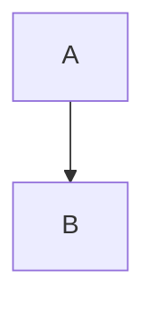

# MDExMermaid Usage Rules

MDExMermaid is a plugin for [MDEx](https://mdelixir.dev) that enables rendering [Mermaid](https://mermaid.js.org) diagrams from markdown code blocks.

## When to Use

Use MDExMermaid when you need to:
- Render Mermaid diagrams from markdown content
- Support flowcharts, sequence diagrams, gantt charts, and other Mermaid diagram types
- Integrate Mermaid diagrams into Phoenix LiveView applications
- Convert markdown with Mermaid code blocks to HTML

## Core API

### Basic Usage

The main function is `MDExMermaid.attach/2` which attaches the plugin to an MDEx document:

```elixir
markdown = """

"""

mdex = MDEx.new(markdown: markdown) |> MDExMermaid.attach()
html = MDEx.to_html!(mdex)
```

### Function Signature

```elixir
MDExMermaid.attach(document, options \\ []) :: MDEx.Document.t()
```

**Options:**
- `:mermaid_init` - HTML to initialize Mermaid (default: auto-inject CDN script)
- `:mermaid_pre_attrs` - Function to generate `<pre>` tag attributes

## Common Patterns

### Static HTML Documents

For simple static documents, the default configuration works out of the box:

```elixir
MDEx.new(markdown: markdown)
|> MDExMermaid.attach()
|> MDEx.to_html!()
```

This injects the default initialization script and renders all mermaid code blocks.

### Custom Pre Attributes

The `:mermaid_pre_attrs` option takes a function that receives a sequence number and returns attribute string:

```elixir
pre_attrs = fn seq ->
  ~s(id="diagram-#{seq}" class="mermaid custom-class")
end

MDEx.new(markdown: markdown)
|> MDExMermaid.attach(mermaid_pre_attrs: pre_attrs)
|> MDEx.to_html!()
```

**IMPORTANT:** Always include unique IDs in custom pre attributes. The sequence number ensures uniqueness.

### Phoenix LiveView Integration

For LiveView apps, disable auto-initialization since you'll manage Mermaid in your JS:

```elixir
# In your LiveView
def render(assigns) do
  ~H"""
  <div><%= {:safe, @html} %></div>
  """
end

def mount(_params, _session, socket) do
  html =
    MDEx.new(markdown: markdown)
    |> MDExMermaid.attach(
      mermaid_init: "",  # Don't inject init script
      mermaid_pre_attrs: fn seq ->
        ~s(id="mermaid-#{seq}" class="mermaid" phx-hook="MermaidHook" phx-update="ignore")
      end
    )
    |> MDEx.to_html!()

  {:ok, assign(socket, html: html)}
end
```

**Client-side JavaScript (using npm):**

```javascript
// assets/js/app.js
import mermaid from 'mermaid'

mermaid.initialize({
  startOnLoad: false,
  securityLevel: 'loose',
  theme: 'default'
})

let hooks = {
  MermaidHook: {
    mounted() {
      mermaid.run({ querySelector: '.mermaid' })
    }
  }
}

let liveSocket = new LiveSocket("/live", Socket, {
  params: {_csrf_token: csrfToken},
  hooks: hooks
})
```

**Client-side JavaScript (using CDN in layout):**

```html
<!-- In your root layout -->
<script type="module">
  import mermaid from 'https://cdn.jsdelivr.net/npm/mermaid@11/dist/mermaid.esm.min.mjs';
  const theme = window.matchMedia('(prefers-color-scheme: dark)').matches ? 'dark' : 'default';
  mermaid.initialize({ startOnLoad: false, securityLevel: 'loose', theme: theme });
  window.mermaid = mermaid;
</script>
```

### DOMContentLoaded Pattern

For pages that require waiting for DOM ready:

```elixir
@mermaid_init """
<script defer src="https://cdn.jsdelivr.net/npm/mermaid@11/dist/mermaid.esm.min.mjs"></script>
<script>
  document.addEventListener("DOMContentLoaded", () => {
    const theme = window.matchMedia('(prefers-color-scheme: dark)').matches ? 'dark' : 'default';
    mermaid.initialize({securityLevel: 'loose', theme: theme});
  });
</script>
"""

MDEx.new(markdown: markdown)
|> MDExMermaid.attach(mermaid_init: @mermaid_init)
|> MDEx.to_html!()
```

### Theme Support

The default configuration auto-detects dark/light mode based on `prefers-color-scheme`:

```javascript
const theme = window.matchMedia('(prefers-color-scheme: dark)').matches ? 'dark' : 'default';
mermaid.initialize({ theme: theme });
```

For custom themes, override `:mermaid_init` with your own configuration.

## Best Practices

### Always Use Unique IDs

Each mermaid diagram must have a unique ID for proper rendering:

```elixir
# GOOD - uses sequence number for uniqueness
fn seq -> ~s(id="mermaid-#{seq}" class="mermaid") end

# BAD - all diagrams have same ID
fn _seq -> ~s(id="mermaid" class="mermaid") end
```

### Include phx-update="ignore" in LiveView

Always use `phx-update="ignore"` to prevent LiveView from re-rendering diagrams:

```elixir
fn seq -> ~s(id="mermaid-#{seq}" class="mermaid" phx-update="ignore") end
```

### Set startOnLoad: false in LiveView

When using with LiveView, disable auto-start and use hooks for manual control:

```javascript
mermaid.initialize({ startOnLoad: false })
```

### Security Level

Use `securityLevel: 'loose'` for most applications. Use `'strict'` only if you're rendering untrusted user content:

```javascript
// For trusted content (most apps)
mermaid.initialize({ securityLevel: 'loose' })

// For untrusted user content
mermaid.initialize({ securityLevel: 'strict' })
```

## Common Anti-Patterns

### DON'T: Duplicate initialization

```elixir
# BAD - Mermaid initialized both in layout AND via plugin
MDEx.new(markdown: markdown)
|> MDExMermaid.attach()  # Injects init script
|> MDEx.to_html!()
# ... and also <script> in layout
```

**Instead:** Choose one initialization method - either let the plugin handle it or manage it yourself with `mermaid_init: ""`.

### DON'T: Forget sequence numbers in custom attrs

```elixir
# BAD - ignores sequence number
fn _seq -> ~s(id="mermaid-1" class="mermaid") end
```

**Instead:** Always use the sequence parameter:
```elixir
fn seq -> ~s(id="mermaid-#{seq}" class="mermaid") end
```

### DON'T: Use startOnLoad: true with LiveView

```javascript
// BAD - conflicts with LiveView rendering
mermaid.initialize({ startOnLoad: true })
```

**Instead:** Use hooks and manual rendering:
```javascript
mermaid.initialize({ startOnLoad: false })
// Then use hooks to call mermaid.run()
```

### DON'T: Forget phx-update="ignore"

```elixir
# BAD - LiveView will re-render and break diagrams
fn seq -> ~s(id="mermaid-#{seq}" class="mermaid" phx-hook="MermaidHook") end
```

**Instead:**
```elixir
fn seq -> ~s(id="mermaid-#{seq}" class="mermaid" phx-hook="MermaidHook" phx-update="ignore") end
```

### DON'T: Call attach() after to_html()

```elixir
# BAD - attach must be called before to_html
html = MDEx.to_html!(mdex)
mdex = MDExMermaid.attach(mdex)  # Too late!
```

**Instead:** Build the pipeline in order:
```elixir
MDEx.new(markdown: markdown)
|> MDExMermaid.attach()
|> MDEx.to_html!()
```

## Pipeline Order

MDExMermaid uses MDEx's plugin system. The correct order is:

1. Create MDEx document: `MDEx.new/1`
2. Attach plugins: `MDExMermaid.attach/2`
3. Convert to HTML: `MDEx.to_html!/1`

```elixir
MDEx.new(markdown: markdown)
|> MDExMermaid.attach(options)
|> MDEx.to_html!()
```

## Code Block Detection

MDExMermaid only processes code blocks tagged as `mermaid`:

````markdown

````

Other code blocks are left untouched.

## Examples

See the [examples directory](https://github.com/leandrocp/mdex_mermaid/tree/main/examples) for complete working examples including LiveView integration.
